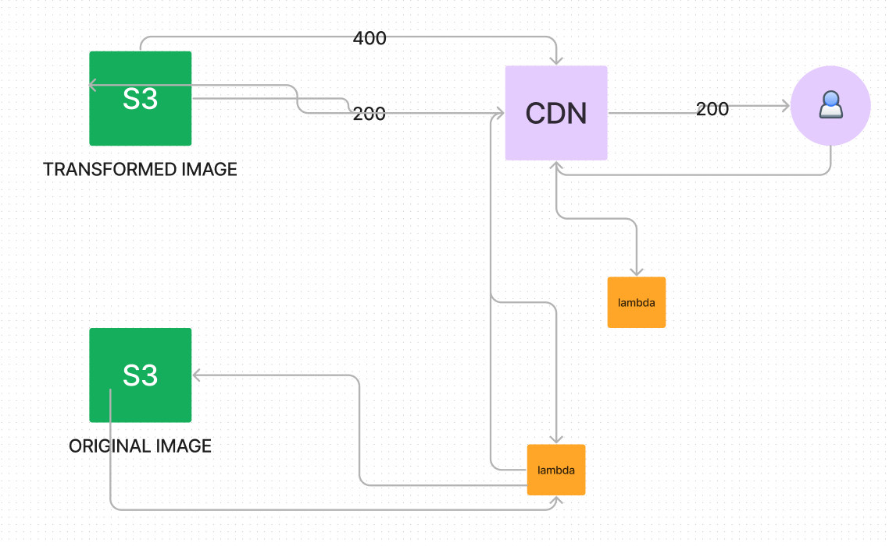

## Image Optimization


## Image Transformation and Caching Architecture

1. **User Request**: The user requests an image with specific transformations via a URL.

2. **CloudFront Function**: A CloudFront Function on the viewer request event rewrites the URL to validate and normalize the transformations, ensuring a higher cache hit ratio. It also selects the best image format based on the `Accept` header if `format=auto` is specified.

3. **CloudFront Cache**: If the transformed image is cached in CloudFront, it is served directly. Origin Shield is enabled to increase cache efficiency.

4. **S3 Bucket**: If the image is not cached, the request is forwarded to an S3 bucket storing transformed images. If found, it is served and cached in CloudFront.

5. **Origin Failover**: If the image is not found in the S3 bucket (403 error), CloudFront retries the request using a secondary origin linked to a Lambda function URL.

6. **Lambda Transformation**: The Lambda function downloads the original image from another S3 bucket, transforms it using the Sharp library, stores the transformed image in S3, and serves it through CloudFront for future caching.

## To RUN
setup aws-cdk in your machine.

clone the repo in your machine
```
npm install
cdk bootstrap
npm run build
cdk deploy
```

